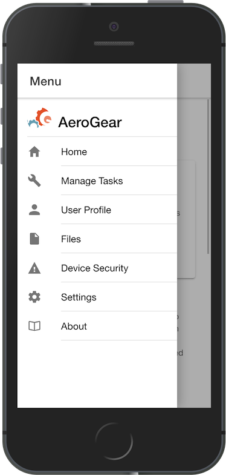

:showcase-app-link: https://github.com/aerogear/ionic-showcase
:integreatly-name: Managed Integration
:mobile-services-name: Mobile Developer Services

= Building secure, data first mobile app solutions with Mobile Developer Services 

This walkthrough demonstrates how to build a showcase app that uses AeroGear DataSync and other mobile enabled services.

{mobile-services-name} simplifies mobile and modern application development, leveraging OpenShift's container technology to provide a secure, scalable backend platform. 
The showcase app that you run in this walkthrough demonstrates:

* building an Ionic Framework and Apache Cordova client side application

* creating a Data Sync service. 
+
The Data Sync framework allows you create apps that perform real-time data synchronization and have offline capabilities.
In this walkthrough, you use the showcase app code which allows many users to create and edit a set of Tasks items.

* adding authentication and authorization to your mobile app using the Identity Management service

* monitoring the showcase app using the Mobile Metrics services
+
This service allows you gather metrics on mobile apps, device versions, device security checks and back-end mobile service usage.

.Deployment

The showcase app includes a Node.js server side application that implements an example GraphQL API and connects to a Postgres database.

image::images/artifacts.png[integration, role="integr8ly-img-responsive"]

[type=walkthroughResource, serviceName=openshift]
.OpenShift Project
****
* link:{openshift-host}/console/project/{walkthrough-namespace}/overview[OpenShift Project, window="_blank"]
****

[type=walkthroughResource]
.Mobile Developer Console
****
* link:{route-mdc-server-host}[Mobile Developer Console, window="_blank"]
****

[type=walkthroughResource]
.Mobile Developer Services Documentation
****
* link:https://access.redhat.com/documentation/en-us/red_hat_mobile_developer_services/1[Documentation, window="_blank"]
****

[type=walkthroughResource,serviceName=codeready]
.CodeReady Workspaces
****
* link:https://developers.redhat.com/products/codeready-workspaces/overview/[Overview, window="_blank"]
* link:https://access.redhat.com/documentation/en-us/red_hat_codeready_workspaces_for_openshift/1.0.0/[Documentation, window="_blank"]
****

[type=walkthroughResource,serviceName=openshift]
.Red Hat OpenShift
****
* link:{openshift-host}/console[Console, window="_blank"]
* link:https://help.openshift.com/[Openshift Online Help Center, window="_blank"]
* link:https://blog.openshift.com/[Openshift Blog, window="_blank"]
****

// NOTES: Till all services will be avaiable as operators inside openshift cluster we will require additional installation steps
// Developers need to provision all services using Tech Preview. 
// To do that please follow README in https://github.com/aerogear/mobile-services-installer

[time=5]
== Deploying the Showcase Data Sync server

The Data Sync framework is a set of libaries (base on the popular Apollo GraphQL server) that allows you to easily create mobile apps that can sync data to the backend with the following features:

* Offline Support
* Conflict Resolution
* Easy integration with other mobile services

This section describes how to deploy the example DataSync server in a {integreatly-name} cluster from the OpenShift Service Catalog.

. Open the link:{openshift-host}[Openshift Console].
// TODO: DataSync templates were removed from integrately. 
// It is not clear for the moment how they will be loaded into Walkthorugh
// We are adding it here manually
. Log into OpenShift from the command line:
.. Click on your username in top right of the OpenShift console and select *Copy Login Command*.
.. Paste the clipboard into your terminal.

. Add the Data Sync template by running:
+
----
oc create -f https://raw.githubusercontent.com/aerogear/datasync-deployment/master/openshift/datasync-showcase-community.yml -n openshift
----

. Create a new project with the following name:
+
----
data-sync-walkthrough
----
. In the new project provision  'Data Sync Showcase' from the service catalog.
[NOTE]
====
* The form is already prefilled with all of the necessary values.
====
+
The hostname for the AMQ Online Broker, (needed by demo sever) is only made available after the resources from the the template have been provisioned. One more step is needed to update the ionic-showcase-server deployment with the correct
`+MQTT_HOST+` environment variable.

. From the terminal, change project:
+
----
oc project data-sync-walkthrough
----

. Update the ionic-showcase-server deployment to add the `+MQTT_HOST+`
variable:
+
----
oc set env dc/ionic-showcase-server MQTT_HOST="$(oc get addressspace showcase -o jsonpath='{.status.endpointStatuses[?(@.name=="messaging")].serviceHost}')"
----

. Navigate to the link:{route-ionic-showcase-server-host}/graphql[GraphQL playground, window="_blank"] and paste the following query/mutation into window:
+
----
query listTasks {
  allTasks {
    title,
    description,
    id
  }
}

mutation createTask {
  createTask(title: "complete the walkthrough", description: "complete the mobile walk through") {
    title,
    description,
    version,
    id
  }
}
----

[type=verification]
Does the GraphQL playground allow you run and view results of the query and mutation?

[type=verificationFail]
----
Check the logs of the `ionic-showcase-server` pod.
It should include the string `+connected to messaging service+`.
Verify that you followed each step in the procedure above.  If you are still having issues, contact your administrator.
----

[time=10]
== Run the DataSync Client Showcase PWA application in CodeReady workspace

The AeroGear showcase app demonstrates the capabilities provided by our Services and SDKs
Starting with Data Sync, Data Sync is a set of Node.js and Client side modules that help you build apps with strong offline and realtime data sync capabilities using GraphQL.
Showcase application can be run on both local machine and directly inside OpenShift thanks to `Code Ready` integration.
In this step we going to utilize Code Ready to build mobile application that will connect to backend we run in previous steps.

=== Steps

. Login to CodeReady and you don’t need to create a workspace.
. Modify the url to something like this:
https://<codeready-host>/f?url=https://github.com/aerogear/ionic-showcase.git
CodeReady will automatically set up a new workspace for you.
. Next, you should be able to find a few prede-fined commands in the “Manage Commands” panel. Run the `build` command to install required dependencies, and then `serve` command to allow preview the app. 
. Replace `mobile-services.json` created in previous steps located in `src/mobile-services.json`
. Execute `serve` command. It will print the URL in console that can be used to launch the application
. Showcase client should be running in your console and be ready to be used in your local browser and phone

[time=3]
== Run application on your browser or phone

// TODO. We might add QR code to showcase for people to scan it in order to 
Showcase app can be launched on mobile phone or your browser. 
Application will contain many views that are designed to showcase various functionalities or our services.
For this showcase we going to focus exclusively on DataSync which is implemented inside `Manage Tasks` view.
DataSync framework will offer cross device synchronization. 
To visualize it properly we need to have application open in at least 2 different devices or browser windows.

=== Steps 

. Open side panel 

. Select `Manage Tasks`
. Initially view will be empty. We can create task using `+` icon.
. Put any information into new Task view and click on create button
. Now we can mark task as `Done` using checkbox.
. We can also edit Task and remove it afterwards
. When doing all changes we should see them being automatically reflected in other aplication

All this functionalities will help us later to showcase various offline and conflict resolution capabilties 
of Data Sync framework.

[time=15]
== DataSync Offline Features

DataSync framework will offer fully featured offline data access capabilities for the mobile and web clients.
Developers can utilize it to build applications that will work independent of the network state.
Showcase application contains integration with all offline capabilities offered by Data Sync Framework.
In footer we should see current network state and number of offline changes we currently have.

image::images/offline-footer.png[integration, role="integr8ly-img-responsive"]

=== Steps

. Let's open create task view and fill all task details
. Please do not press create yet
. To leverage offline capabilities we need to make sure that our application looses conectivity with our server. 
On the Mobile phone this can be done by turning on airplane mode. 
In Chrome browser you can use the Network tab from Chrome Developer Tools to simulate offline mode. (open them using F12, or using Command+Option+I on macOS)
. Make your device go offline
. Press `Create` button to create an new task
. We should see task created and our `Offline Changes` button in footer containing now one change.
. Let's edit task multiple times
. Each edit will create new Task
. We can review all offline items directly by clicking on `Offline Changes` button.
. Please restore connectivity (depending on your device)
. We should see all `Offline Changes` reflected back to server and appearing in second instance of the application.

[time=6]
== Conflict resolution functionalities

Data Conflicts can happen when resource we modified was also modified on server.
DataSync Framework enables multiple strategies to deal with conflicts. 
By default Showcase will resolve conflicts by applying all server side changes on top of the client.
In case of direct conflicts client field value will be used. 
To simulate conflict we need to go offline and make edits in two instance of the application at the same time.

=== Steps

. Use one of the existing task or create new one that will be visible on two devices.
. Go offline 
. Edit Task on first instance
. Go to second instance of the application
. Edit Task on second instance
. At this point we should have server side updated by second instance of the application
and first application not knowing about that change because it went offline.
. This operation will result in conflict. 
. Once we make first client online again - data conflict will occur.
We should see popup and actuall server side data being replicated back to the client (conflict was resolved automatically)

. Use the “Manage Tasks” page in the showcase client app.
. Try create one task in one device, and it should show up immediately in another.
. Try bring one client offline (, perform some actions, bring it online and you should see the changes synced to another app straight away.
. To create conflicts, try bringing both clients offline, and modify the same item. The last instance of app that is online will receive conflicts.