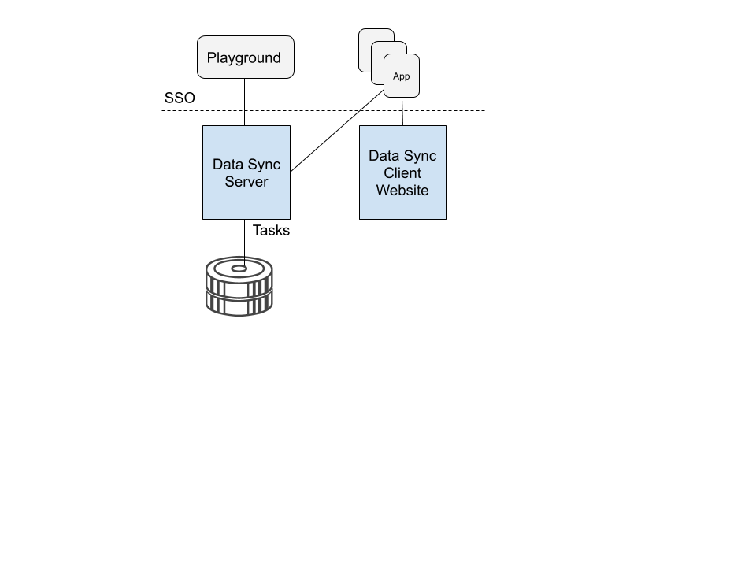

:showcase-app-link: https://github.com/aerogear/ionic-showcase
:integreatly-name: Managed Integration
:mobile-services-name: Mobile Developer Services
:crw-name: CodeReady Workspaces
:customer-sso-name: End user SSO instance

= Running the mobile showcase application with {mobile-services-name}

This Solution pattern demonstrates running the GraphQL PWA Showcase Application using Red Hat Mobile Developer Services.

It will show you how to:

* Build and run the link:{showcase-app-link}[Ionic based GraphQL Client app].
* Deploy the data sync server of the GraphQL Showcase app.
* Protect the showcase GraphQL app and the backend service using the Red Hat SSO.

It will also introduce you to all features offered by the AeroGear Data Sync framework.

[type=walkthroughResource, serviceName=openshift]
.Mobile Project in OpenShift
****
* link:{openshift-host}/console/project/{walkthrough-namespace}/overview[OpenShift Project, window="_blank"]
****

[type=walkthroughResource]
.Mobile Developer Services Documentation
****
* link:https://access.redhat.com/documentation/en-us/red_hat_managed_integration/1/html-single/getting_started_with_mobile_developer_services/index[Getting Started with Mobile Developer Services, window="_blank"]
****

:sectnums:

[time=10]
== Deploying the Showcase Data Sync server

You first need to deploy the data sync server of the showcase app.

. Login to the link:{openshift-host}/console[OpenShift Console, window="_blank"]
. Navigate to the link:{openshift-host}/console/project/{walkthrough-namespace}/overview[mobile project, window="_blank"] in OpenShift.
. Click the *Browse Catalog* button.
. Search the service catalog for 'Data Sync Showcase'.

. Click on the 'Data Sync Showcase' entry to add it to your project.

. Accept all the defaults of the provisioning wizard and click *Create*.

. Check the *Overview* screen of your project and wait until three pods are running:
+
* `ionic-showcase-server` - a Node.js app
* `mosquitto-mqtt-broker` - a message broker
* `postgresql` - a database.

. Navigate to the link:{route-ionic-showcase-server-host}/graphql[GraphQL playground, window="_blank"] and remove any text in the left pane of the screen. Paste the following query/mutation into the left pane of the screen:
+
----
query listTasks {
  allTasks {
    title,
    description,
    id
  }
}

mutation createTask {
  createTask(title: "complete the walkthrough", description: "complete the GraphQL walkthrough") {
    title,
    description,
    version,
    id
  }
}
----
+
The query and mutation code can be used to verify your environment.

[type=verification]
****
. Click the Run icon in the middle of the playground screen.
. Choose createTask from the menu.
The system should create a task.
. Choose listTasks from the Run menu.
. Check that the following is displayed in the right hand panel:
+
----
{
    "data": {
        "allTasks": [
            {
                "title": "complete the walkthrough",
                "description": "complete the GraphQL walkthrough",
                "id": "1"
            }
        ]
    }
}----
****

[type=verificationFail]
****
Check the logs of the `ionic-showcase-server` pod.

It should include the string `+connected to messaging service+`.
Verify that you followed each step in the procedure above.  If you are still having issues, contact your administrator.
****

[time=10]
== Access the showcase app in a browser

The showcase app demonstrates the key capabilities provided by AeroGear Data Sync framework
It can run either as a hybrid mobile application, or a Progressive Web App (PWA).

. Go to link:{route-ionic-showcase-server-host}[Showcase app, window="_blank"]
. Select  *Manage Tasks* from the left hand menu.

[type=verification]
****
. Create a task by clicking on the plus icon in the top right-hand side of the screen.
. Add a title and description to the task and click *Create*.
. Open the same URL in a different tab.
. Change the status of the task by clicking/unclicking the text box beside the task.
. Verify that the status of the task is synced across all tabs in real-time.
****

[type=verificationFail]
****
Verify that you followed each step in the procedure above.  If you are still having issues, contact your administrator.
****

[time=15]
== Protect the mobile showcase app using the Identity Management service

In this task, you use the Identity Management service to protect both the client (PWA) and the data sync server.

=== Add Identity Management service to the client app (PWA) and create a realm for users

. Make sure you have access to a realm in the user-facing SSO instance. If you don't have access, you can ask your customer-admin user to create one for you. 
. In new realm we going to create two new clients - one for server side and one for the client side application.
. Open URL obtained from adminstrator
. Login to keycloak (you will be asked to provide additional details like email and name)
. When completing login process you should see the main keycloak realm page
. In the right menu choose *Clients* under *Configure* in the menu.
.. Click on the *Create* button on the top-right corner to start creating a new client.
.. Enter `showcase-app-client` for Client ID.  Do not change the rest of the fields.
.. Save the client. You should see the *Settings* page of the client.
.. You should see the *Settings* page of the client.
.. Change the `Valid Redirect URIs` to '{route-ionic-showcase-server-host}*'
.. Change the `Web Origins` to '*'
.. Click on the *Installation* tab, and select `Keycloak OIDC JSON` format. Use the `Download` button to save the configuration file to a directory on the computer.

. Navigate to the project config-maps section {openshift-host}/console/project/{walkthrough-namespace}/browse/config-maps
. Select `webapp-config`
. Add new `auth` section in config by utilizing the config that was copied in previous step.
. In configuration replace `auth-server-url` to `url` and `resource` to `clientId`
. Configuration should look as follows

---
    window.showcaseConfig = {
      "backend": {
        "serverUrl": "/graphql",
        "wsServerUrl": ((window.location.protocol === "https:") ? "wss://" : "ws://") + window.location.hostname + "/graphql"
      }
      "auth": {
        "realm": "your realm",
        "url": "https://your-server/auth",
        "clientId": "your-client"
      }
    };
---

. Save and wait for server to redeploy

=== Configure Identity Management service for the showcase client applications

. Navigate to keycloak realm to create new client.
 
+
----
admin
----

. Create a new client for the showcase data sync server:
.. Choose *Clients* under *Configure* in the menu.
.. Click on the *Create* button on the top-right corner to start creating a new client.
.. Enter `showcase-app-server` for Client ID.  Do not change the rest of the fields.
.. Save the client. You should see the *Settings* page of the client.
.. Change the `Access Type` to `bearer-only` and save again.
.. Click on the *Installation* tab, and select `Keycloak OIDC JSON` format. Use the `Download` button to save the configuration file to a directory on the computer.

. Create some users for the showcase app:
.. Select *Users* on the left menu, and click on *View all users*.
.. Click on *Add user* to create a new user. Pick a username you like for the *Username* field and click *Save*.
.. Navigate to `Credentials` tab and set a password for this user. Set `Temporary` option to `OFF`.

. Update the showcase sync server app to use the downloaded configuration file:
.. Navigate to the link:{openshift-host}/console/project/{walkthrough-namespace}/browse/config-maps[Config Maps page of the OpenShift console].
.. Click *Create Config Map*.
.. When prompted for *Name*, enter:
+
----
showcase-server-idm-config
----
.. When prompted for *Key*, enter:
+
----
keycloak.json
----
.. For *Value*, click *Browse* and load the `keycloak.json` file that you downloaded previously.
.. Click *Create*. The config map object is created.

.. Choose *Deployments* from the *Applications* menu.

.. Select the deployment config for `ionic-showcase-server`.

.. Click on the *Configuration* tab, and scroll to the *Volumes* section.

.. Click on the *Add Config Files* option at the bottom of the section.

.. Choose the `showcase-server-idm-config` config map as the *Source*.
.. Set the value for *Mount Path* to:
+
----
/tmp/keycloak
----

.. Click *Add* to trigger a new deployment.

.. Click the *Environment* tab and click *Add Value*.
... Set Name to:
+
----
KEYCLOAK_CONFIG
----
... Set Value to:
+
----
/tmp/keycloak/keycloak.json
----
+
Wait for the deployment to complete and the showcase data sync server is running.

[type=verification]
****
Has the deployment completed?
****

[type=verificationFail]
****
Verify that you followed each step in the procedure above.  If you are still having issues, contact your administrator.
****

[time=10]
== Exploring data sync features using the showcase app

To explore data sync features, run the multiple instances of the data sync app using different browsers.
For example, use the browser on your mobile device as well as using the browser on your laptop.

image::images/showcase.png[showcase, role="integr8ly-img-responsive"]

=== Demonstrating real-time sync

. On your laptop:
.. Select *Manage Tasks*.
.. Create a new task using *+* icon.
.. Enter some task text  and click *Create*.

. On your mobile device:
.. Check that the same task appears in the *Manage Tasks* page.
.. Make some changes to the task.

. On your laptop:
.. Check that the task changes are appear.

[type=verification]
****
Did the tasks appear as expected?
****

[type=verificationFail]
****
Verify that you followed each step in the procedure above.  If you are still having issues, contact your administrator.
****

=== Demonstrationg offline support

. On your mobile device:
.. Log into the showcase app.
.. Activate airplane mode or disable network connectivity.
.. Create a new task.
The task should be created and the *Offline Changes* button in the footer should contain one change.
.. Make a few more changes by either editing existing tasks, or creating new ones.
.. Review all the changes by clicking the *Offline Changes* button.

. On your laptop:
.. Log into the showcase app.
.. Check *Manage Tasks* content.
You do not see any of the changes from the mobile device.

. On your mobile device:
.. Restore connectivity or deactivate airplane modes.
.. Watch the status of the tasks change.

. On your laptop:
.. Check *Manage Tasks* content.
.. Check that all the tasks are synced.

[type=verification]
****
Did the tasks appear as expected?
****

[type=verificationFail]
****
Verify that you followed each step in the procedure above.  If you are still having issues, contact your administrator.
****

=== Avoiding and resolving conflicts

. On your mobile device:
.. Log into the showcase app.
.. Create a task `todo A`.
.. Activate airplane mode or disable network connectivity.
.. Edit the task description to add the text `edited on mobile`.

. On your laptop:
.. Log into the showcase app.
.. Simulate offline mode. For example, in Chrome, press F12 to open *Developer Tools* and select *offline* in  the *Network* tab.
.. Edit the `todo A` task, change the text to `todo B`.

. Bring both of your devices back online, the tasks should sync without a conflict.

. On your mobile device:
.. Activate airplane mode or disable network connectivity.
.. Edit task `todo B` change the description to:
+
----
Conflicting description from mobile
----

. On your laptop:
.. Simulate offline mode. For example, in Chrome, press F12 to open *Developer Tools* and select *offline* in  the *Network* tab.
.. Edit task `todo B` change the description to:
+
----
Conflicting description from laptop
----

. Bring both of your devices back online, a popup window should appear warning you about conflicts.

[type=verification]
****
Did the tasks sync as expected?
****

[type=verificationFail]
****
Verify that you followed each step in the procedure above.  If you are still having issues, contact your administrator.
****
