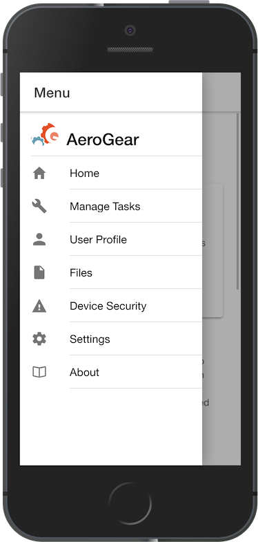

:showcase-app-link: https://github.com/aerogear/ionic-showcase
:integreatly-name: Managed Integration
:mobile-services-name: Mobile Developer Services

= Running the mobile showcase application with {mobile-services-name}

This walkthrough demonstrates running the mobile showcase application using the services provided by Mobile Developer Services. 

It will show you how to:

* Build and run the link:{showcase-app-link}[Ionic mobile showcase app].
* Deploy the data sync server of the mobile showcase app.
* Protect the showcase mobile app and the backend service using the Identity Management service.

It will also introduce you to all features are offered by the data sync framework.

[type=walkthroughResource, serviceName=openshift]
.OpenShift Project
****
* link:{openshift-host}/console/project/{walkthrough-namespace}/overview[OpenShift Project, window="_blank"]
****

[type=walkthroughResource]
.Mobile Developer Console
****
* link:{mdc-url}[Mobile Developer Console, window="_blank"]
****

[type=walkthroughResource]
.Mobile Developer Services Documentation
****
* link:https://access.redhat.com/documentation/en-us/red_hat_mobile_developer_services/1[Documentation, window="_blank"]
****

[type=walkthroughResource,serviceName=codeready]
.CodeReady Workspaces
****
* link:{che-url}[Console, window="_blank"]
* link:https://developers.redhat.com/products/codeready-workspaces/overview/[Overview, window="_blank"]
* link:https://access.redhat.com/documentation/en-us/red_hat_codeready_workspaces_for_openshift/1.0.0/[Documentation, window="_blank"]
****

[type=walkthroughResource,serviceName=openshift]
.Red Hat OpenShift
****
* link:{openshift-host}/console[Console, window="_blank"]
* link:https://help.openshift.com/[Openshift Online Help Center, window="_blank"]
* link:https://blog.openshift.com/[Openshift Blog, window="_blank"]
****

[time=10]
== Deploying the Showcase Data Sync server

You first need to deploy the data sync server of the showcase app.

. Login to the link:{openshift-host}/console[OpenShift Console, window="_blank"]
. Navigate to the existing project for this walkthrough
link:{openshift-host}/console/project/{walkthrough-namespace}/overview[OpenShift Project, window="_blank"]
. Browse the template catalog. 
. Search for the 'Data Sync Showcase' template and click on it to start provisioning.
[NOTE]
====
The form will be pre-filled with all of the necessary values.
====
. Click the create button
. This will trigger a new deployment and wait for it to complete successfully.
. Navigate to the link:{route-ionic-showcase-server-host}/graphql[GraphQL playground, window="_blank"] and paste the following query/mutation into window:
+
----
query listTasks {
  allTasks {
    title,
    description,
    id
  }
}

mutation createTask {
  createTask(title: "complete the walkthrough", description: "complete the mobile walk through") {
    title,
    description,
    version,
    id
  }
}
----

[type=verification]
Does the GraphQL playground allow you run and view results of the query and mutation?

[type=verificationFail]
****
Check the logs of the `ionic-showcase-server` pod.
It should include the string `+connected to messaging service+`.
Verify that you followed each step in the procedure above.  If you are still having issues, contact your administrator.
****

[time=5]
== Creating a mobile app in Mobile Developer Console

The Mobile Developer Console allows mobile developers to view available mobile services, connect them to their mobile apps and get the mobile app configurations.

. Log in to the link:{mdc-url}[Mobile Developer Console, window="_blank"]
. Click *Create Mobile App* to register your mobile app.
. Enter the following name for your mobile app:
+
----
showcase-app
----
+
After the mobile app is registered, it is displayed on the console.
. Click on the *showcase-app* card to display the configuration screen.
. Click the *Mobile Services* tab.
. Click *Bind to App* for *Data Sync* in the *Unbound Services* section.
. Click `Next` on Binding screen.
. In Parameters Section provide {route-ionic-showcase-server-host} as `Server URL`
. Copy `mobile-services.json` to some temporary location. We going to need it later.

[time=10]
== Build and run the mobile showcase app in a browser using CodeReady

The showcase app demonstrates the key capabilities provided by {mobile-services-name}. It can run either as a hybrid mobile application, or a progressive web app (PWA).

In this step we will use CodeReady to build it as a PWA and run it in a browser.

=== Steps

. Login to link:{che-url}[CodeReady Console, window="_blank"] and don't create a workspace just yet.
. Download Showcase template from github:
https://raw.githubusercontent.com/aerogear/ionic-showcase/master/.factory.json
. Go to `Factories` menu on the left side panel
. Provide a name
. Select Source: *Config* and attach previously downloaded file
. Select Create
. In new window select Open to open workspace. 
This should create new CodeReady workspace.
. Open `src/mobile-services.json` in the CodeReady editor and replace it with the saved file content from the previous section.
. Next, you should be able to find a few pre-defined commands in the “Manage Commands” panel. Run the `build` command to install required dependencies.
. Execute `serve` command. It will print the URL in console that can be used to launch the application. Open the URL in a browser tab and you should see the showcase app working.
. Open the `Manage Tasks` page of the showcase app and try create a few tasks. You can open the same URL in a few different tabs and see the tasks synced across all of them in real-time.

[time=15]
== Protect the mobile showcase app by Identity Management service

The showcase app is working, but not secure. Let's use the Identity Management service to protect both the client and the data sync server.

=== Add Identity Management service to the client app

. Go to the link:{mdc-url}[Mobile Developer Console, window="_blank"].
. Click on the *showcase-app* card to display the configuration screen.
. Click the *Mobile Services* tab.
. Click *Bind to App* for *Identity Management* in the *Unbound Services* section, with the following parameters:
.. Admin User Name: `admin`
.. Admin User Password: `admin`
. Close the wizard. Once the binding process is completed, you should the *Identity Management* row is moved to the `Bound Services` section.
. Go back to the `Configuration` tab of the app and you should see the content of `mobile-services.json` is updated. Copy the content and save it somewhere on the computer.

=== Add Identity Management service to the showcase client and server applications

. Go to the `Mobile Services` tab again and expand the *Identity Management* row. Open the `Keycloak Realm URL` in a new tab.
. Login with username `admin` and password `admin`.
. After the console is loaded, we need to create a new client for the showcase data sync server and add some users for the showcase app:
.. Choose `Configure -> clients` in the menu.
.. Click on the `Create` button on the top-right corner, and create a new client with the following parameters:
... Client ID: `showcase-app-server`
... Do not change the rest of the fields.
.. Save the client. You should see the *Settings* page of the client.
.. Change the `Access Type` to `bearer-only` and save again.
.. Click on the `Installation` tab, and select `Keycloak OIDC JSON` format. Use the `Download` button to save the configuration file to a directory on the computer.
.. Select `Users` on the left menu, and click on `View all users`. You will see there is only 1 admin user in the realm. Click on `Add user` to create new ones. Pick a username you like and save.
.. Go to `Credentials` tab and set a password for this user. Set `Temporary` option to `OFF`.
. Next, we need to update the showcase sync server app to use the downloaded configuration file:
.. Go to the link:{openshift-host}/console/project/{walkthrough-namespace}/browse/config-maps[Config Maps page of the OpenShift console], and click on `Create Config Map`.
.. In the creation form, enter the following values:
... Name: `showcase-server-idm-config`
... Key: `keycloak.json`
... Value: Use the `Browser` button to load the `keycloak.json` file that was downloaded previously.
.. Once the config map object is created, go to `Applications -> Deployments`. Select the deployment config for `ionic-showcase-server`.
.. Click on the *Configuration* tab, and find the `Volumes` section. Click on the `Add Config Files` at the bottom of the section.
... Choose the `showcase-server-idm-config` config map as the *Source*.
... Set the value for *Mount Path* to be `/tmp/keycloak`.
... Click on `Add`. This will trigger a new deployment.
.. Go to the *Environment* tab of the deployment config, and add a new environment variable:
... Name: `KEYCLOAK_CONFIG`
... Value: `/tmp/keycloak/keycloak.json`
.. Wait for the deployment to complete and the showcase data sync server is running.
. Navigate to the link:{route-ionic-showcase-server-host}/graphql[GraphQL playground, window="_blank"] page again and refresh the page. This time you should get an `Access Denied` error. This is because the endpoint is now protected by Keycloak and requires user authentication.

=== Update the config of the showcase client app and run it

. Go to link:{che-url}[CodeReady Console, window="_blank"] and open the workspace for the showcase app that we have created in one of the previous steps.
. Open `src/mobile-services.json` in the CodeReady editor and replace it with the updated version from the Mobile Developer Console.
. Execute the `build` and `serve` commands again. Open the URL in a browser tab and this time you will be presented with a login page.
. Login with the user credentials you have created, and you should be able to continue using the app. Try create more tasks and see if it works.

[time=10]
== Exploring data sync features using the showcase app

In oder to use the showcase app to explore data sync features, it's best to run the multiple instances of the app using different browsers. You can run it in a browser on a mobile device if you have one. 

=== Real time sync 

. Select one instance of the app and open side panel 
. Select `Manage Tasks`.
. Create a new task using `+` icon.
. Put any information into the New Task view and click on the create button
. Check other instances of the app and you should see the same task appear.
. Make some changes to the task in any instance of the app, and you should see the all the changes are automatically synced across all instances.

=== Offline Support

. In order to demo the offline feature, we need to get the device into offline mode first.
.. On a mobile phone this can be done by turning on airplane mode. 
.. In a browser you can use the developer tool to simulate offline mode (For example, in Chrome, you can open it by pressing F12, or using Command+Option+I on macOS. Select the `Network` tab, and check `Offline`).
. Create a new task in the showcase app. The task should be created and the `Offline Changes` button in the footer should contain one change.
. Try make a few more changes by either editing existing tasks, or creating new ones.
. You can review all the changes you have made while offline directly by clicking on `Offline Changes` button.
. Check other instances of the app and you will not see any of the changes you have made because the current one is offline.
. Restore connectivity, and once the client is online again, you should see all `Offline Changes` are synced to the server and appearing in other instances of the showcase app.

=== Conflict resolution

. Make sure there are 2 instances of the app running.
. In both instances of the app:
.. Go offline
.. Make changes on name and description fields for the same tasks on two separate clients
. Bring both of them back online again. You will see a popup showing up in the last instance that is back online warning about conflicts.
. Go offline on both clients
. Make changes on the name field on first client and description on the second one 
. Bring both of them back online again. You should see changes merged on both clients automatically without conflict popup

// [time=5]
// == View the metrics data of mobile services

// TODO - complete this section once the metrics stack is available

// [time=10]
// == Check the audit logs

// You can use the OpenShift logging feature to see the audit logs that are generated by the syncserver app.

// === Steps

// . Find out the URL of the Kibana dashboard of your OpenShift cluster:
// .. Run the following commands on the bastion server (as root user):
// +
// ----
// oc project openshift-logging
// oc get route
// ----
// +
// .. You should see there is a route called `logging-kibana`. Copy the `Host` value of that route and open it in your browser. You should see the Kibana dashboard page.
// . Filter out the audit log messages in Kibana. 
// .. On the `Discover` page, there should be a dropdown you can select on this page. Choose the namespace where the syncserver app is deployed to, and take a look at the messages.
// .. You should see a lot of messages, try expand one and see what the message looks like.
// .. In the `Search` field on the top, enter `tag:AUDIT` and you should be able to see the audit logs generated by the app. If you can't see any message, go to the GraphqQL playground page and execute some queries and then try search again.
// .. [Optional] Follow the steps descibed in link:https://github.com/aerogear/apollo-voyager-server/blob/master/doc/guides/metrics-and-audit-logs.md#importing-kibana-saved-objects:[Importing Kibana Saved Objects guide] and try importing a dashboard template for the sync app, and view the imported dashboard.
