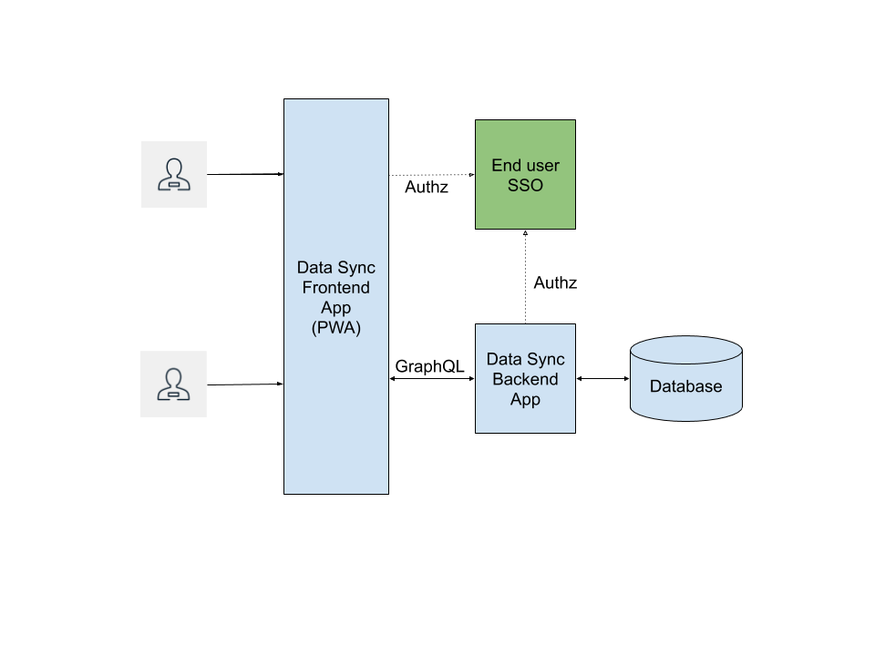

:showcase-app-link: https://github.com/aerogear/ionic-showcase
:integreatly-name: Managed Integration
:data-sync-name: Data Sync
:data-sync-showcase-app: Data Sync showcase application
:customer-sso-name: Customer Application SSO instance
:sso-realm-url: {user-sso-url}/auth/admin/walkthroughs/console/index.html

= Adding Data Sync to your Application with GraphQL

Data Sync is a framework that helps developers build applications that can perform realtime data synchronization with GraphQL.
 
This solution pattern will show you how to:

* Configure and run the link:{showcase-app-link}[{data-sync-showcase-app}] on OpenShift.
* Protect the application's frontend and backend using Red Hat SSO.
* Explore all the capabilities provided by {data-sync-name}.

The following diagram shows the architecture of the {data-sync-showcase-app}:

[type=walkthroughResource, serviceName=openshift]
.Project in OpenShift
****
* link:{openshift-host}/console/project/{walkthrough-namespace}/overview[OpenShift Project, window="_blank"]
****

[type=walkthroughResource]
.Data Sync Documentation
****
* link:https://access.redhat.com/documentation/en-us/red_hat_managed_integration/1/html-single/developing_a_data_sync_app/index[Getting Started with {data-sync-name}, window="_blank"]
****

:sectnums:

[time=10]
== Deploying the showcase application

. Navigate to the link:{openshift-host}/console/project/{walkthrough-namespace}/overview[project console, window="_blank"] in OpenShift.
. Click on the *Browse Catalog* button.
. Search the service catalog for 'Data Sync Showcase'.
. Click on the 'Data Sync Showcase' entry to add it to your project.
. Accept all the defaults of the provisioning wizard and click *Create*.
. Check the *Overview* screen of your project and wait until three pods are running:
+
* `ionic-showcase-server` - a Node.js server and client application
* `mosquitto-mqtt-broker` - a message broker
* `postgresql` - a database

You can use the build-in GraphQL playground to interact with the server API. Navigate to the link:{route-ionic-showcase-server-host}/graphql[GraphQL playground, window="_blank"] and remove any text in the left pane of the screen. Paste the following query/mutation into the left pane of the screen:

----
query listTasks {
  allTasks {
    title,
    description,
    id
  }
}

mutation createTask {
  createTask(title: "complete the walkthrough", description: "complete the GraphQL walkthrough") {
    title,
    description,
    version,
    id
  }
}
----

[type=verification]
****
. Click the Run icon in the middle of the playground screen.
. Choose createTask from the menu.
The system should create a task.
. Choose listTasks from the Run menu.
. Check that the following is displayed in the right hand panel:
+
----
{
    "data": {
        "allTasks": [
            {
                "title": "complete the walkthrough",
                "description": "complete the GraphQL walkthrough",
                "id": "1"
            }
        ]
    }
}----
****

[type=verificationFail]
****
Check the logs of the `ionic-showcase-server` pod.

It should include the string `+connected to messaging service+`.
Verify that you followed each step in the procedure above.  If you are still having issues, contact your administrator.
****

[time=5]
== Access the client app in a browser

The showcase app demonstrates the key capabilities provided by the {data-sync-name} framework.
It can be run either as a hybrid mobile application, or a Progressive Web App (PWA).

. Go to the link:{route-ionic-showcase-server-host}[newly created client app, window="_blank"]
. Select *Manage Tasks* from the left hand menu.

[type=verification]
****
. Create a task by clicking on the plus icon in the top right-hand side of the screen.
. Add a title and description, of your choosing, to the task and click *Create*.
. Open the link:{route-ionic-showcase-server-host}[tasks section of the client app, window="_blank"] in a different tab.
. Change the status of the task by clicking/unclicking the text box beside the task.
. Verify that the status of the task is synced across all tabs in real-time.
****

[type=verificationFail]
****
Verify that you followed each step in the procedure above.  If you are still having issues, contact your administrator.
****

[time=15]
== Protect the showcase app using the Red Hat SSO

In this task, we will protect both the frontend and the backend of the {data-sync-showcase-app} with the {customer-sso-name}.

=== Configure and protect the frontend app

. Make sure you have access to a realm in the link:{sso-realm-url}[{customer-sso-name}, window="_blank"]. If you do not, you can ask your customer-admin user to create one for you. 
. Login to the realm in the link:{sso-realm-url}[{customer-sso-name}, window="_blank"].
. Create a new client for the frontend app:
.. Choose *Clients* under *Configure* in the menu on the left of the screen.
.. Click on the *Create* button on the top-right corner to create a new client.
.. Enter `{user-username}-frontend` for Client ID. Do not change any other fields.
.. Save the client. You should see the *Settings* page of the client.
.. Change `Valid Redirect URIs` to `{route-ionic-showcase-server-host}*`
.. Change `Web Origins` to `*`
.. Click on the *Save* button
.. Click on the *Installation* tab, and select `Keycloak OIDC JSON` format. Copy the content displayed or use the `Download` button to save the configuration file.

. Update the configuration of the frontend app to secure it:
.. Navigate to the link:{openshift-host}/console/project/{walkthrough-namespace}/browse/config-maps[Config Maps page of the OpenShift console].
.. Select the config map that is called `webapp-config`, and edit it by selecting `Edit` under the `Actions` button.
.. Add a new `auth` section to the config map by pasting the content that was copied in the previous step.
.. Rename the `auth-server-url` attribute to `url` and the `resource` attribute to `clientId`.
[type=verification]
****
Does the content of the config map look as follows:
****
[subs="attributes"]
----
   window.showcaseConfig = {
     "backend": {
       "serverUrl": "/graphql",
       "wsServerUrl": ((window.location.protocol === "https:") ? "wss://" : "ws://") + window.location.hostname + "/graphql"
     },
     "auth": {
       "realm": "walkthroughs",
    	 "url": " {user-sso-url}/auth",
   	   "ssl-required": "none",
   	   "clientId": "{user-username}-frontend",
   	   "public-client": true,
   	   "confidential-port": 0
     }
   };
----

[type=verificationFail]
****
Verify that you followed each step in the procedure above.  If you are still having issues, contact your administrator.
****
[time=10]

Save it and wait for the app to be re-deployed.

=== Configure and protect the backend app

. Login to the realm in the link:{sso-realm-url}[{customer-sso-name}, window="_blank"].
. Create a new client for the backend:
.. Choose *Clients* under *Configure* in the menu.
.. Click on the *Create* button on the top-right corner to start creating a new client.
.. Enter `{user-username}-server` for Client ID.  Do not change the rest of the fields.
.. Save the client. You should see the *Settings* page of the client.
.. Change the `Access Type` to `bearer-only` and save again.
.. Click on the *Installation* tab, and select `OIDC JSON` format. Copy the content or use the `Download` button to save the configuration file to a directory on the computer.

In order to use the application, we also need to create a few users so that we can login:

. Select *Users* on the left menu, and click on *View all users*.
. Click on *Add user* to create a new user. Pick a username you like for the *Username* field and click *Save*.
. Navigate to `Credentials` tab and set a password for this user. Set `Temporary` option to `OFF`.

Now, we will update the backend to use the downloaded configuration file:
. Navigate to the link:{openshift-host}/console/project/{walkthrough-namespace}/browse/config-maps[Config Maps page of the OpenShift console].
. Click *Create Config Map*.
. When prompted for *Name*, enter:

----
showcase-server-idm-config
----
.. When prompted for *Key*, enter:
+
----
keycloak.json
----
.. For *Value*, click *Browse* and load the `keycloak.json` file that you downloaded previously.
.. Click *Create*. The config map object is created.

.. Choose *Deployments* from the *Applications* menu.

.. Select the deployment config for `ionic-showcase-server`.

.. Click on the *Configuration* tab, and scroll to the *Volumes* section.

.. Click on the *Add Config Files* option at the bottom of the section.

.. Choose the `showcase-server-idm-config` config map as the *Source*.
.. Set the value for *Mount Path* to:
+
----
/tmp/keycloak
----

.. Click *Add* to trigger a new deployment.

.. Click the *Environment* tab and click *Add Value*.
... Set Name to:
+
----
KEYCLOAK_CONFIG
----
... Set Value to:
+
----
/tmp/keycloak/keycloak.json
----
+
Wait for the deployment to complete and the showcase data sync server is running.

[type=verification]
****
Has the deployment completed? Do you see SSO login screen when refreshing application?
****

[type=verificationFail]
****
Verify that you followed each step in the procedure above.  If you are still having issues, contact your administrator.
****

[time=10]
== Exploring data sync features using the showcase app

To explore data sync features, you should run multiple instances of the showcase app using different browsers.
For example, use the browser on your mobile device as well as using the browser on your laptop.

image::images/showcase.png[showcase, role="integr8ly-img-responsive"]

=== Real-time sync

. On your laptop:
.. Select *Manage Tasks*.
.. Create a new task using *+* icon.
.. Enter some task text  and click *Create*.

. On your mobile device:
.. Check that the same task appears in the *Manage Tasks* page.
.. Make some changes to the task.

. On your laptop:
.. Check that the task changes are appear.

[type=verification]
****
Did the tasks appear as expected?
****

[type=verificationFail]
****
Verify that you followed each step in the procedure above.  If you are still having issues, contact your administrator.
****

=== Offline support

. On your mobile device:
.. Log into the showcase app.
.. Activate airplane mode or disable network connectivity.
.. Create a new task.
The task should be created and the *Offline Changes* button in the footer should contain one change.
.. Make a few more changes by either editing existing tasks, or creating new ones.
.. Review all the changes by clicking the *Offline Changes* button.

. On your laptop:
.. Log into the showcase app.
.. Check *Manage Tasks* content.
You do not see any of the changes from the mobile device.

. On your mobile device:
.. Restore connectivity or deactivate airplane modes.
.. Watch the status of the tasks change.

. On your laptop:
.. Check *Manage Tasks* content.
.. Check that all the tasks are synced.

[type=verification]
****
Did the tasks appear as expected?
****

[type=verificationFail]
****
Verify that you followed each step in the procedure above.  If you are still having issues, contact your administrator.
****

=== Resolving conflicts

. On your mobile device:
.. Log into the showcase app.
.. Create a task `todo A`.
.. Activate airplane mode or disable network connectivity.
.. Edit the task description to add the text `edited on mobile`.

. On your laptop:
.. Log into the showcase app.
.. Simulate offline mode. For example, in Chrome, press F12 to open *Developer Tools* and select *offline* in  the *Network* tab.
.. Edit the `todo A` task, change the text to `todo B`.

. Bring both of your devices back online, the tasks should sync without a conflict.

. On your mobile device:
.. Activate airplane mode or disable network connectivity.
.. Edit task `todo B` change the description to:
+
----
Conflicting description from mobile
----

. On your laptop:
.. Simulate offline mode. For example, in Chrome, press F12 to open *Developer Tools* and select *offline* in  the *Network* tab.
.. Edit task `todo B` change the description to:
+
----
Conflicting description from laptop
----

. Bring both of your devices back online, a popup window should appear warning you about conflicts.

[type=verification]
****
Did the tasks sync as expected?
****

[type=verificationFail]
****
Verify that you followed each step in the procedure above.  If you are still having issues, contact your administrator.
****
